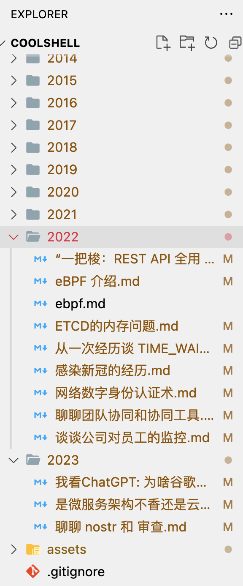

# 酷壳 Markdown版本备份

这里是[酷壳https://coolshell.cn](https://coolshell.cn/)的markdown 版本备份。抓取了酷壳（左耳朵耗子 陈皓的知名技术博客）的全量文章，转成了markdown格式用git仓库的方式永久保存。并对图片，链接进行了本地化。

建议clone仓库到本地，配合vscode+ Markdown插件进行阅读. 

文章按年份为目录进行了归类。[陈皓手工推荐列表](./featured.md)

## 全站热门索引

- [程序员技术练级攻略](./2011/%E7%A8%8B%E5%BA%8F%E5%91%98%E6%8A%80%E6%9C%AF%E7%BB%83%E7%BA%A7%E6%94%BB%E7%95%A5.md)
- [“火柴棍式”程序员面试题](./2011/%E2%80%9C%E7%81%AB%E6%9F%B4%E6%A3%8D%E5%BC%8F%E2%80%9D%E7%A8%8B%E5%BA%8F%E5%91%98%E9%9D%A2%E8%AF%95%E9%A2%98.md)
- [简明 Vim 练级攻略](./2011/%E7%AE%80%E6%98%8E%20Vim%20%E7%BB%83%E7%BA%A7%E6%94%BB%E7%95%A5.md)
- [“作环保的程序员，从不用百度开始”](./2013/%E2%80%9C%E4%BD%9C%E7%8E%AF%E4%BF%9D%E7%9A%84%E7%A8%8B%E5%BA%8F%E5%91%98%EF%BC%8C%E4%BB%8E%E4%B8%8D%E7%94%A8%E7%99%BE%E5%BA%A6%E5%BC%80%E5%A7%8B%E2%80%9D.md)
- [TCP 的那些事儿（上）](./2014/TCP%20%E7%9A%84%E9%82%A3%E4%BA%9B%E4%BA%8B%E5%84%BF%EF%BC%88%E4%B8%8A%EF%BC%89.md)
- [AWK 简明教程](/2013/AWK%20%E7%AE%80%E6%98%8E%E6%95%99%E7%A8%8B.md)
- [做个环保主义的程序员](/2012/%E5%81%9A%E4%B8%AA%E7%8E%AF%E4%BF%9D%E4%B8%BB%E4%B9%89%E7%9A%84%E7%A8%8B%E5%BA%8F%E5%91%98.md)
- [编程能力与编程年龄](/2013/%E7%BC%96%E7%A8%8B%E8%83%BD%E5%8A%9B%E4%B8%8E%E7%BC%96%E7%A8%8B%E5%B9%B4%E9%BE%84.md)
- [二维码的生成细节和原理](/2013/%E4%BA%8C%E7%BB%B4%E7%A0%81%E7%9A%84%E7%94%9F%E6%88%90%E7%BB%86%E8%8A%82%E5%92%8C%E5%8E%9F%E7%90%86.md)
- [sed 简明教程](/2013/sed%20%E7%AE%80%E6%98%8E%E6%95%99%E7%A8%8B.md)
- [如何学好C语言](/2011/%E5%A6%82%E4%BD%95%E5%AD%A6%E5%A5%BDC%E8%AF%AD%E8%A8%80.md)
- [如何超过大多数人](./2019/%E5%A6%82%E4%BD%95%E8%B6%85%E8%BF%87%E5%A4%A7%E5%A4%9A%E6%95%B0%E4%BA%BA.md)
- [技术人员的发展之路](./2016/%E6%8A%80%E6%9C%AF%E4%BA%BA%E5%91%98%E7%9A%84%E5%8F%91%E5%B1%95%E4%B9%8B%E8%B7%AF.md)
- [疫苗：Java HashMap的死循环](/2013/%E7%96%AB%E8%8B%97%EF%BC%9AJava%20HashMap%E7%9A%84%E6%AD%BB%E5%BE%AA%E7%8E%AF.md)
- [由12306.cn谈谈网站性能技术](/2012/%E7%94%B112306.cn%E8%B0%88%E8%B0%88%E7%BD%91%E7%AB%99%E6%80%A7%E8%83%BD%E6%8A%80%E6%9C%AF.md)
- [应该知道的Linux技巧](/2013/%E5%BA%94%E8%AF%A5%E7%9F%A5%E9%81%93%E7%9A%84Linux%E6%8A%80%E5%B7%A7.md)
- [缓存更新的套路](/2016/%E7%BC%93%E5%AD%98%E6%9B%B4%E6%96%B0%E7%9A%84%E5%A5%97%E8%B7%AF.md)
- [分布式系统的事务处理](/2014/%E5%88%86%E5%B8%83%E5%BC%8F%E7%B3%BB%E7%BB%9F%E7%9A%84%E4%BA%8B%E5%8A%A1%E5%A4%84%E7%90%86.md)
- [TCP 的那些事儿（下）](/2014/TCP%20%E7%9A%84%E9%82%A3%E4%BA%9B%E4%BA%8B%E5%84%BF%EF%BC%88%E4%B8%8B%EF%BC%89.md)
- [“21天教你学会C++”](/2010/%E2%80%9C21%E5%A4%A9%E6%95%99%E4%BD%A0%E5%AD%A6%E4%BC%9AC%2B%2B%E2%80%9D.md)
- [别让自己“墙”了自己](/2019/%E5%88%AB%E8%AE%A9%E8%87%AA%E5%B7%B1%E2%80%9C%E5%A2%99%E2%80%9D%E4%BA%86%E8%87%AA%E5%B7%B1.md)
- [无锁队列的实现](/2012/%E6%97%A0%E9%94%81%E9%98%9F%E5%88%97%E7%9A%84%E5%AE%9E%E7%8E%B0.md)
- [Lua简明教程](/2013/Lua%E7%AE%80%E6%98%8E%E6%95%99%E7%A8%8B.md)
- [性能调优攻略](/2012/%E6%80%A7%E8%83%BD%E8%B0%83%E4%BC%98%E6%94%BB%E7%95%A5.md)
- [MySQL性能优化的最佳20+条经验](/2009/MySQL%E6%80%A7%E8%83%BD%E4%BC%98%E5%8C%96%E7%9A%84%E6%9C%80%E4%BD%B320%2B%E6%9D%A1%E7%BB%8F%E9%AA%8C.md)
- [如何写出无法维护的代码](/2011/%E5%A6%82%E4%BD%95%E5%86%99%E5%87%BA%E6%97%A0%E6%B3%95%E7%BB%B4%E6%8A%A4%E7%9A%84%E4%BB%A3%E7%A0%81.md)
- [6个变态的C语言Hello World程序](/2009/6%E4%B8%AA%E5%8F%98%E6%80%81%E7%9A%84C%E8%AF%AD%E8%A8%80Hello%20World%E7%A8%8B%E5%BA%8F.md)
- [Docker基础技术：Linux Namespace（上）](/2015/Docker%E5%9F%BA%E7%A1%80%E6%8A%80%E6%9C%AF%EF%BC%9ALinux%20Namespace%EF%BC%88%E4%B8%8A%EF%BC%89.md)
- [28个Unix/Linux的命令行神器](/2012/28%E4%B8%AAUnix-Linux%E7%9A%84%E5%91%BD%E4%BB%A4%E8%A1%8C%E7%A5%9E%E5%99%A8.md)
- [无插件Vim编程技巧](/2014/%E6%97%A0%E6%8F%92%E4%BB%B6Vim%E7%BC%96%E7%A8%8B%E6%8A%80%E5%B7%A7.md)

## 关于整理此博客

5月15日得知陈皓去世消息的时候，第一眼感觉是恶作剧，后面看到大量消息才知道这是真的，顿时不知所措，不知道该怎么接收这个信息。

知道陈皓是从酷壳这个网站开始，在他和玉伯的论战之时有了第一次的互动，酷壳中的一些文章深深的影响了我的技术价值判断，陈皓作为一个有着坚定技术价值的引路人，影响了非常多的技术人的成长，但我没为陈皓付过一分钱，也没买过课程，实在不想陈皓就此离我远去，但我又做不了什么，人生真的是反复无常，在没有的时候才越发觉得可贵。为了将这一宝贵的资源继续传递下去，特整理成markdown格式，方便更多的人。

整理仓促，如有错误，欢迎指正，PR.

耗叔，走好，感谢人生路上有你。

## Copyright申明

本仓库整理自https://coolshell.cn, 版权归酷壳(https://coolshell.cn)作者陈皓以及其所有权人所有。根据https://coolshell.cn的协议，转载文章请注明作者和出处 酷 壳 – CoolShell ，请勿用于任何商业用途。